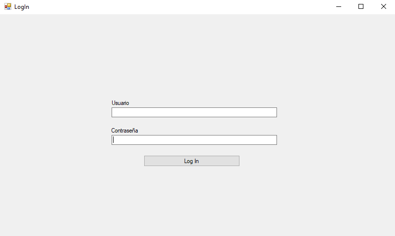
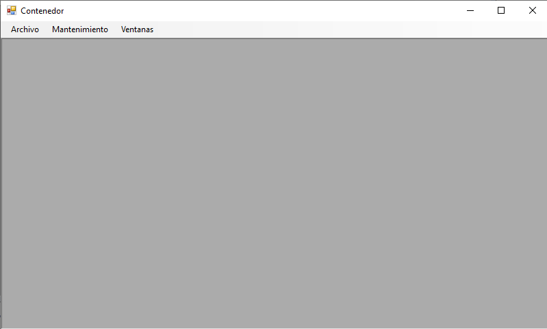
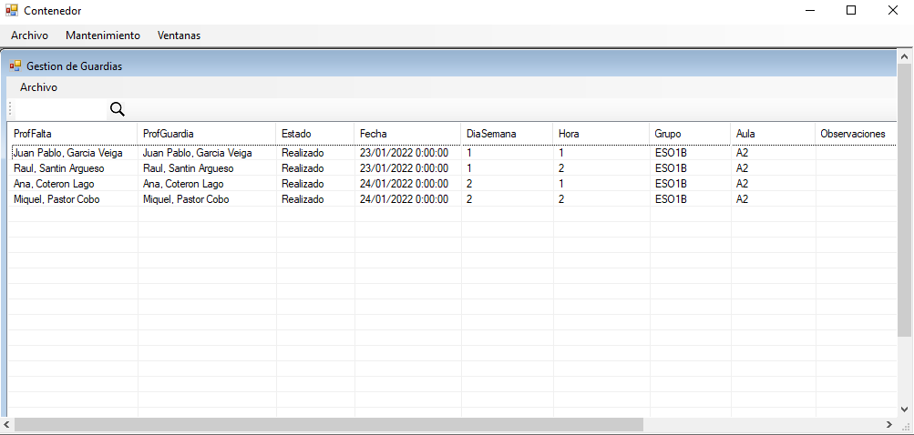
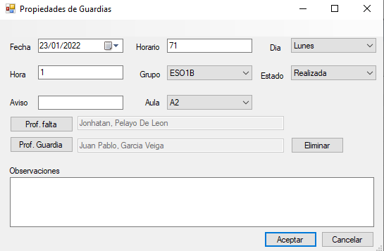
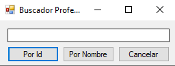

### APLICACIÓN DE ESCRITORIO GUARDIAS CENTRO
---

### ÍNDICE
1. [INTRODUCCIÓN](#introducción)
2. [DESCRIPCIÓN](#descripción)

## INTRODUCCIÓN
Aplicación de escritorio para el proyecto de guardias centro, desarrollada en Visual Studio, en lenguaje c#. 

##  DESCRIPCIÓN 
La aplicación se divide en 5 ventanas o formularios dedicadas a distintas tareas:

**Login**
Esta es la ventana principal, la cual aparece nada más iniciar la aplicación. Esta consiste en dos TextBox que recogen por separado el usuario y contraseña del profesor que quiere acceder a la aplicación, un botón que se usará para llamar a los métodos que comprueban que el usuario, contraseña y perfil de dicho profesor sean correctos así como de encriptar la contraseña antes de mandar los datos a la API, y de un GroupBox cuyo cometido es informar al usuario de que los datos introducidos son erróneos.



**Contenedor**
Una vez logueado el usuario accede a la siguiente ventana, la cual es un contenedor MDI para permitir la apertura de distintas ventanas de gestión como es la de Gestión de Guardias, de la cual va esta aplicación y las que se quieran añadir a futuro, esta ventana tiene como función actuar de intermediario para que el usuario pueda acceder a las ventanas de gestión que desee, ordene las pestañas o haga LogOut.



**Gestión de guardias**
Esta ventana muestra en una lista los datos principales de las guardias y ordena estas por fecha, un menú contextual te permite borrar, modificar, cambiar el estado o crear una nueva guardia (esta última opción se comparte con el menú de la parte superior) una pequeña barra de herramientas te permite hacer un filtrado en la lista y por campos, y las guardias no cubiertas aparecerán coloreadas de rojo.



**Propiedades de guardias**
Al pulsar los botones de crear o modificar una guardia se abrirá esta ventana la cual nos permite rellenar todos los campos de las guardias con los datos que precisemos, posee dos botones para elegir al profesor que hace la guardia y al que falta, mostrandose asi por sus nombres y apellidos al usuario, así como otro para vaciar el campo del profesor que hace guardia ya que no podrán editarse directamente, por ultimo posee un menú con la opción de auto rellenar los campos restantes si ya has rellenado los campos fecha, profesor ausente y hora.



**Buscador Profesor**
Esta es una ventana de ayuda que se abre al pulsar los botones para añadir profesores en "Propiedades de Guardias", es una ventana simple que nos permite encontrar un profesor en base a su id o su nombre para luego mostrarlo en la ventana anterior por nombre y apellidos.



Básicamente, estos son los apartados que encontraremos dentro de la aplicación de escritorio.

---

```sh
Jesús Bueno González
Ana Belen Fernández San Miguel
Andrea Murillo González
Laura Tejera Aldazábal
```
